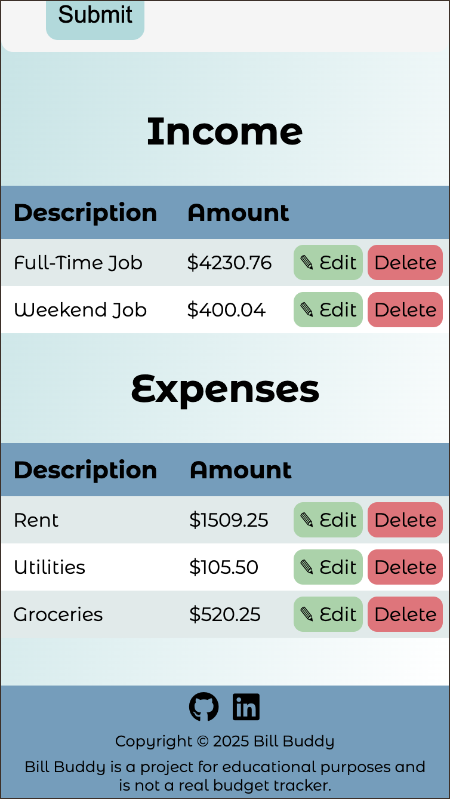

# Bill Buddy - A Budget Tracking App




## Description

Bill Buddy is a simple, clean, and user-friendly budget-tracking application built with JavaScript, SASS, object-oriented programming principles, and automated testing with Mocha and Chai. It allows users to easily track income and expenses, calculate their total budget, and view real-time updates as new entries are added. The project emphasizes modular code structure, dynamic UI updates, and clean, maintainable styling using SASS features such as variables and mixins.

##  Features

#### User-Friendly Interface
* Intuitive layout designed for quick entry and review.
* Input fields for entering income and expense descriptions and amounts.
* Dedicated buttons to add income or expenses.
* Clear display showing:
  * Total Income
  * Total Expenses
  * Overall Budget (Income – Expenses)
* Ability to edit and delete income and expenses.

#### Budget Calculation
* Automatically calculates the total budget each time an income or expense is added.
* Dynamically updates all values on the UI.

#### Functionality
* Add new income items with description + amount.
* Add new expense items with description + amount.
* Validation prevents empty inputs, invalid numbers, or malformed entries.
* Proper error handling ensures a smooth user experience.
* All totals and summary values update instantly.

#### Object-Oriented Programming
* Includes a Budget class to manage:
  * Income collection
  * Expense collection
  * Total budget calculation
* Encapsulates all budget-related logic within class methods for clean architecture.
* Demonstrates OOP concepts such as:
  * Encapsulation
  * Modularity

#### Testing
* Manual testing
* Automated Testing
  * The project includes a suite of automated unit tests written with Mocha (test runner) and Chai (assertion library).
  * To run the tests:
  ```
    npm install
    npm test
  ```

## Getting Started
### [Bill Buddy](https://budget-tracker-azure-eight.vercel.app/) is hosted using Vercel

### How to Use
* Enter a description for your income or expense.
* Enter the corresponding amount.
* Click either Add Income or Add Expense.
* Watch your total income, total expenses, and overall budget update instantly.
* Continue adding entries as needed to track your financial activity.

### Installing

* Fork and Clone the application

### Executing program

```
# cd into the application directory
cd budget-tracker

# run command to open home page of the application
open index.html
```


## Authors

* [Renee Messersmith](https://www.linkedin.com/in/reneemessersmith/)
